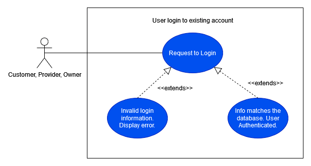

# Milestone 1 Planning

## Summary of Project

- This website platform where talented service providers, trade specialists, entrepreneurs, and those seeking help with any project gather, on one easy to use interface to find and receive work.
- The system will allow customers to post job listings, and providers to bid on those job listings. After bidding is over a customer can select their preferred provider.
- Customers and providers will be able to review each other after each project in order to keep both the customer and provider satisfied
- A small fee will be added to each sale, fees are decided based on frequency of listings and reviews.

## Team Organization

- Project Manager
  - Kyler Nelson
- Designers and Developers
  - Wesley Perrett - Main UX/UI Designer
  - Keaton Anderson - Developer
  - Richard Snider - Developer

## Development Process Description

- GitHub Git Flow
- At least 2 reviews on each PR, will do sprint-level reviews of master
- Master branch and Feature Branches
- Each new feature create a branch
- Create many small commits
- Create pull request
- Merge to master
## Policies, Procedures, Comms Tools

- Discord - Main channel for communication. Used for group communication, collaborative activities, and sharing small files.
- Google Drive - Storage for files needed that are not directly part of the project documentation. Files outlining Milestone 1.
- GitHub - Code and (long-term) documentation hosting.
- Trello - Use for collaboration on project as well as tracking time estimates

## Risk Analysis
- **Database Structure**
  - Likelihood - Low
  - Severity - High
  - Consequences - Heavy amount of technical debt, difficulty in future extensibility of application, poor application design
  - Workaround - None. Just do it right the first time so we don&#39;t have to redo the database schema.
- **Login/Authentication**
  - Likelihood - Low
  - Severity - High
  - Consequences - Improper user authentication could lead to many users being able to perform privileged actions. User experience would suffer if users were unable to login or perform actions they expect to perform.
  - Work-Around - None. System will not work properly without a good Login/Authentication.
- **UI**
  - Likelihood - Low
  - Severity - High
  - Consequences - Users would be unable to interact with the application.
  - Work-Around - None. System requires a way for user interaction.
- **Hosting**
  - Likelihood - Low
  - Severity - High
  - Consequences - System would be unable to serve files and information to users
  - Work-Around - Host server using cloud hosting systems.

# Requirements Definition
## Intro and Context (Req. Defs)

Throughout the year, homeowners have lots of work to get done on their property that they may not want to do themselves. To help fix this problem, this project aims to build a system to allow users to list and accept yard work jobs.

The system will allow customers to post job listings for a variety of common yard tasks (lawn mowing, snow shoveling, leaf raking, possibly more). Customers will be able to see and choose which offering providers they choose to give the job to. Customers will be able to set a preferred time for the job to be completed. The customer will be asked to verify that the job is done when the system thinks it is, and review the provider that performed the requested task. The charge for each job will be taken out of the customer&#39;s account upon completion of each job. The system will provide a way for customers to see and manage their active job listings.

The system will allow providers to browse local job listings, and bid against other providers on each job. The provider will be able to tell the system that an accepted job is completed, and their account will be paid once the customer verifies the job&#39;s completion. The system will provide a way for providers to see, and manage their accepted, and tentative jobs.

This system will provide a great platform for yard work customers and providers to interact with each other and get what both parties need.

## Users and their Goals

- As a new user, I can create an account and select my account type.

- As a customer, provider, or owner I can log in to the website to see information relating to me and my account.

- As a customer, I can post a job so that service providers can see what is available. This includes estimated time to complete, and a time frame of the job.

- As a provider, I can view job listings that are available to me. These listings can be filtered in a few different ways.

- As a service provider, I can make an offer of a certain rate or amount for a job I see listed

- As a customer or provider, I can add funds to my account balance for use in transactions.

- As a provider, I can place a review on customers I perform work for after finishing a job. As a customer, I can place a review on providers that perform my requested work.

- As a customer/provider, I can edit my profile information.

## Functional Requirements

## Non-functional Requirements

## Future Features

- Provider ability to hide customers
- Customer ability to hide providers
- Integrated Chat System (If time permits)
- Push Notifications/message inbox
- Order History and status
- Repeating job listings
  - Regular customer/provider interactions

## Glossary

- Customer - Someone who is using the website primarily for posting services
- Provider - Someone who is using the website primarily for providing services
- Post/Listing - A posting made by a customer detailing the work that they want to pay to have done.
