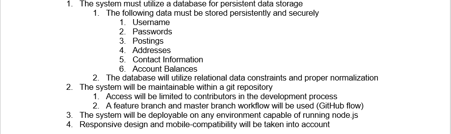

<h1> Milestone 1 Planning </h1>

**Summary of Project**

- This website platform where talented service providers, trade specialists, entrepreneurs, and those seeking help with any project gather, on one easy to use interface to find and receive work.
- The system will allow customers to post job listings, and providers to bid on those job listings. After bidding is over a customer can select their preferred provider.
- Customers and providers will be able to review each other after each project in order to keep both the customer and provider satisfied
- A small fee will be added to each sale, fees are decided based on frequency of listings and reviews.

**Team Organization**

- Project Manager
  - Kyler Nelson
- Designers and Developers
  - Wesley Perrett - Main UX/UI Designer
  - Keaton Anderson - Developer
  - Richard Snider - Developer

**Dev Process Description**

- GitHub Git Flow
- At least 2 reviews on each PR, will do sprint-level reviews of master
- Master branch and Feature Branches
- Each new feature create a branch
- Create many small commits
- Create pull request
- Merge to master

**Policies, Procedures, Comms Tools**

- Discord - Main channel for communication. Used for group communication, collaborative activities, and sharing small files.
- Google Drive - Storage for files needed that are not directly part of the project documentation. Files outlining Milestone 1.
- GitHub - Code and (long-term) documentation hosting.
- Trello - Use for collaboration on project as well as tracking time estimates

**Risk Analysis**

- **think about this on thursday**
- Password Storage - Severity: High - Mitigation: Hash passwords with a strong hashing algorithm (ex. Bcrypt or argon2)
- Database Structure - Ineffective data storage can lead to muddled results
- Login/Authentication -
  -

**Use Case Diagrams**

- (Customer/Provider) Login - Keaton
- (Customer/Provider) Sign up - Keaton

- (Provider) Bid on listings - Kyler
- (Customer/Provider) Add funds - Kyler
- (Provider) Review Customer - on order - Richard
- (Customer) Review Provider - on login - Richard

**Intro and Context (Req. Defs)**

Throughout the year, homeowners have lots of work to get done on their property that they may not want to do themselves. To help fix this problem, this project aims to build a system to allow users to list and accept yard work jobs.

The system will allow customers to post job listings for a variety of common yard tasks (lawn mowing, snow shoveling, leaf raking, possibly more). Customers will be able to see and choose which offering providers they choose to give the job to. Customers will be able to set a preferred time for the job to be completed. The customer will be asked to verify that the job is done when the system thinks it is, and review the provider that performed the requested task. The charge for each job will be taken out of the customer&#39;s account upon completion of each job. The system will provide a way for customers to see and manage their active job listings.

The system will allow providers to browse local job listings, and bid against other providers on each job. The provider will be able to tell the system that an accepted job is completed, and their account will be paid once the customer verifies the job&#39;s completion. The system will provide a way for providers to see, and manage their accepted, and tentative jobs.

This system will provide a great platform for yard work customers and providers to interact with each other and get what both parties need.

**Users and their Goals**

- As a customer, I can post a job so that service providers can see what is available. This includes estimated time to complete, and a time frame of the job - Posting a job listing
- As a service provider, I can make an offer of a certain rate or amount for the job - Bid on listings
- As a customer, provider, or owner I can log in to the website to see information relating to me and my account. - Login
- As a new user, I can create an account and select my account (type, preference)(customer or provider). - Sign Up
- As a provider, I can view job listings that are available to me.These listings can be filtered in a few different ways. - Browse listing
- As a customer or provider, I can add funds to my account balance for use in transactions. - Add funds
- As a provider, I can place a review on customers I perform work for after finishing a job. - Review Customer
- As a customer, I can place a review on providers that perform my requested work. - Review Provider

**Functional Reqs**

**Non-functional Reqs **

**Future Features**

- Provider ability to hide customers
- Customer ability to hide providers
- Integrated Chat System (If time permits)
- Push Notifications/message inbox
- Order History and status
- Repeating job listings
  - Regular customer/provider interactions

**Glossary**

- Customer - Someone who is using the website primarily for posting services
- Provider - Someone who is using the website primarily for providing services
- Post/Listing - A posting made by a customer detailing the work that they want to pay to have done.

**README** - (Describe workspace and naming)

- Docs directory - Contains all project documentation. No application code exists in this directory
- **Pull in the specifics from the readme sample on canvas**

**Version Control Policies and Procedures**

- Use GitHub Pull Requests
- Get two reviews on each Pull Request
- Commit often
- Keep branches self-contained
- Code Reviews: Learn each others&#39; coding styles

**Tool stack description and setup procedure**

- Code formatter - Prettier - To ensure consistent code formatting
- Framework - Express
- ORM - Sequelize
- Templating Engine - Handlebars or EJS (TBD)
- Unit Test Framework - Mocha

**Build instructions**

1. Install the latest release of node.js version 16
2. Clone the repository
3. Execute the following commands in the repository directory (folder should contain a file called package.json):

  1. `npm install`
  2. `npm run migrate`
1. To start the server, run the following command:

  1. `npm start`
1. The server will be available at the port and address indicated by the program&#39;s console output.

**Unit testing instructions**

Perform the following steps after performing the first three steps of the build instructions

1. Navigate to the repository&#39;s root directory (where the package.json file is)
2. Execute the following command: `npm test`

**System testing instructions**

System-level testing is done by hand. To conduct system testing, start up an instance of the server by running `npm start` from the repository root if the server is not already running. If you haven&#39;t followed the build directions, perform the steps described in the build section before continuing. After the server is running, navigate to the address indicated in the server&#39;s console output. System testing is performed by walking through each user task/use case and ensuring proper completion of each task from beginning to end, testing all different use case scenarios.

**Other development notes, as needed**

- Links to the packages we use and their docs
- Link to express docs - [https://expressjs.com/en/4x/api.html](https://expressjs.com/en/4x/api.html) (API Reference, docs can also be found linked from this page)
- Link to Sequelize ORM docs - https://sequelize.org/v7/
- Link to Mocha Docs - https://mochajs.org/#table-of-contents