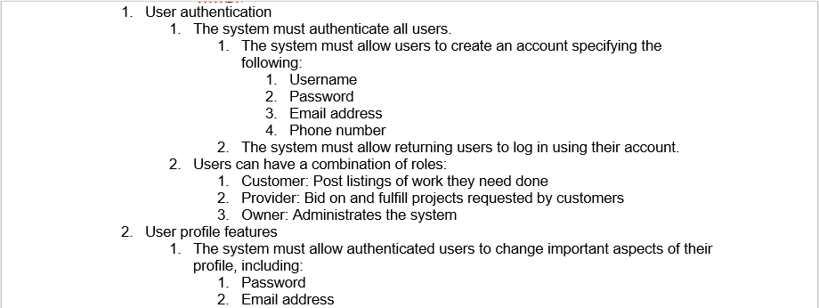
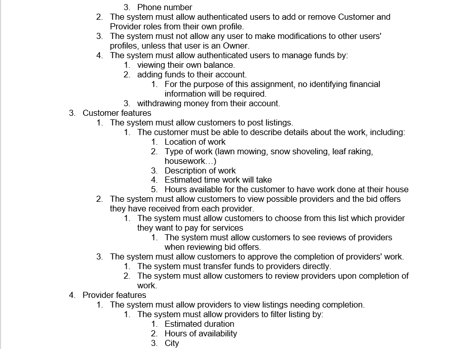
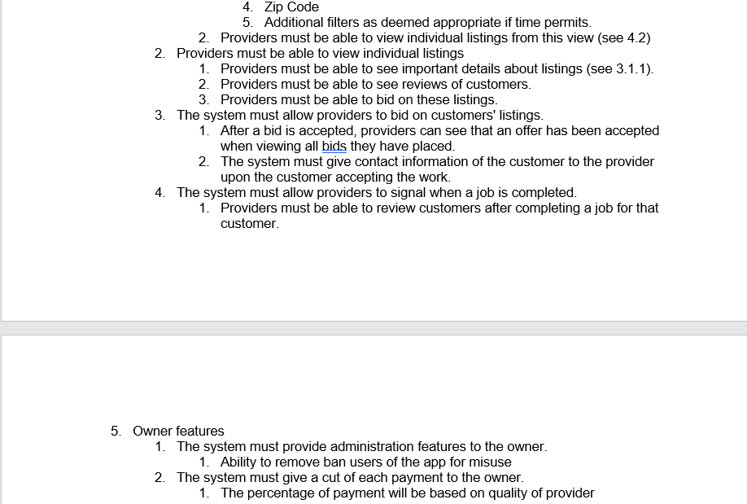
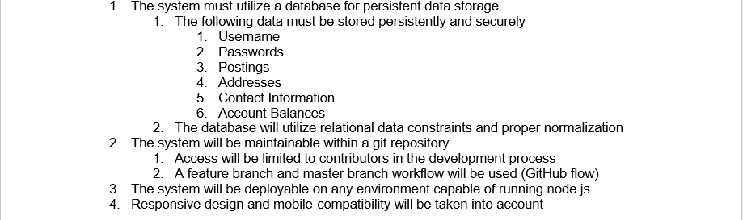

# Requirements Definition
## Intro and Context (Req. Defs)

Throughout the year, homeowners have lots of work to get done on their property that they may not want to do themselves. To help fix this problem, this project aims to build a system to allow users to list and accept yard work jobs.

The system will allow customers to post job listings for a variety of common yard tasks (lawn mowing, snow shoveling, leaf raking, possibly more). Customers will be able to see and choose which offering providers they choose to give the job to. Customers will be able to set a preferred time for the job to be completed. The customer will be asked to verify that the job is done when the system thinks it is, and review the provider that performed the requested task. The charge for each job will be taken out of the customer&#39;s account upon completion of each job. The system will provide a way for customers to see and manage their active job listings.

The system will allow providers to browse local job listings, and bid against other providers on each job. The provider will be able to tell the system that an accepted job is completed, and their account will be paid once the customer verifies the job&#39;s completion. The system will provide a way for providers to see, and manage their accepted, and tentative jobs.

This system will provide a great platform for yard work customers and providers to interact with each other and get what both parties need.

## Users and their Goals

- As a new user, I can create an account and select my account type.

  - Participating actor(s): Customer, Provider
  - Entry Conditions:
    - User asks to create account
    - User redirected when not logged in
  - Exit Conditions:
    - User navigates away
    - User finishes creating account
  - Event Flow:
    1. User enters account creation page
    2. User enters valid account information
    3. Account info is added to database
    4. User is returned to site

- As a customer, provider, or owner I can log in to the website to see information relating to me and my account.

  - Participating actor(s): Customer, Provider, Owner
  - Entry Conditions:
    - User asks to login
    - User redirected when not logged in
  - Exit Conditions:
    - User navigates away
    - User logs in
  - Event Flow:
    1. User enters login page
    2. User enters email and password
    3. Database verifies user
    4. User returned to sight with authentication

- As a customer, I can post a job so that service providers can see what is available. This includes estimated time to complete, and a time frame of the job.

- As a provider, I can view job listings that are available to me. These listings can be filtered in a few different ways.

- As a service provider, I can make an offer of a certain rate or amount for a job I see listed

- As a customer, I can add funds to my account balance for use in transactions.

- As a provider, I can place a review on customers I perform work for after finishing a job. As a customer, I can place a review on providers that perform my requested work.  
  
  - Participating actor(s): Customer, Provider
  - Entry conditions:
      - Customer has finished assigned work from particular Provider.
  - Exit conditions:
      - Provider and Customer have reviewed each other.
  - Event flow:
      1. Provider marks work complete
      1. Customer inspects work, either accepts or denies work completion
      1. Upon acceptance, funds are transferred to Provider
      1. Provider and Customer review each other

- As a customer/provider, I can edit my profile information.  
  
  - Participating actor(s): Customer, Provider (collectively Users)
  - Entry conditions:
      - User requests to change profile
  - Exit conditions:
      - User applies changes; OR
      - User navigates away
  - Event flow:
    1. User has option to change:
        - Email
        - Password
        - Phone Number
        - Preferred display role

## Functional Requirements

## Non-functional Requirements

## Future Features

- Provider ability to hide customers
- Customer ability to hide providers
- Integrated Chat System (If time permits)
- Push Notifications/message inbox
- Order History and status
- Repeating job listings
  - Regular customer/provider interactions

## Glossary

- Customer - Someone who is using the website primarily for posting services
- Provider - Someone who is using the website primarily for providing services
- Post/Listing - A posting made by a customer detailing the work that they want to pay to have done.
