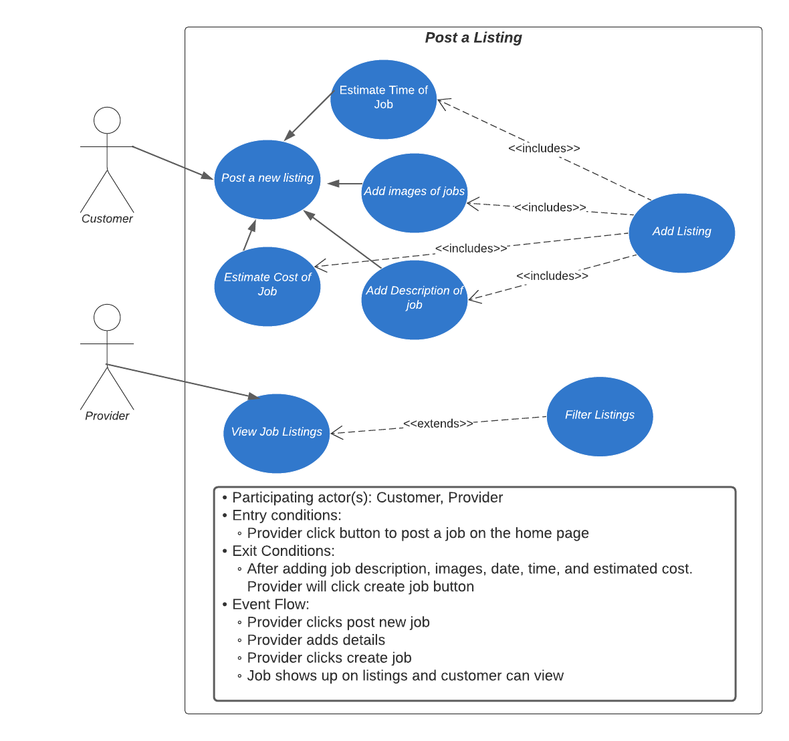

# Requirements Definition

## Intro and Context (Req. Defs)

Throughout the year, homeowners have lots of work to get done on their property that they may not want to do themselves. To help fix this problem, this project aims to build a system to allow users to list and accept yard work jobs.

The system will allow customers to post job listings for a variety of common yard tasks (lawn mowing, snow shoveling, leaf raking, possibly more). Customers will be able to see and choose which offering providers they choose to give the job to. Customers will be able to set a preferred time for the job to be completed. The customer will be asked to verify that the job is done when the system thinks it is, and review the provider that performed the requested task. The charge for each job will be taken out of the customer's account upon completion of each job. The system will provide a way for customers to see and manage their active job listings.

The system will allow providers to browse local job listings, and bid against other providers on each job. The provider will be able to tell the system that an accepted job is completed, and their account will be paid once the customer verifies the job's completion. The system will provide a way for providers to see, and manage their accepted, and tentative jobs.

This system will provide a great platform for yard work customers and providers to interact with each other and get what both parties need.

## Users and their Goals

- As a new user, I can create an account and select my account type.

  

  - Participating actor(s): Customer, Provider
  - Entry Conditions:
    - User asks to create account
    - User redirected when not logged in
  - Exit Conditions:
    - User navigates away
    - User finishes creating account
  - Event Flow:
    1. User enters account creation page
    2. User enters valid account information
    3. Account info is added to database
    4. User is returned to site

- As a customer, provider, or owner I can log in to the website to see information relating to me and my account.

  

  - Participating actor(s): Customer, Provider, Owner
  - Entry Conditions:
    - User asks to login
    - User redirected when not logged in
  - Exit Conditions:
    - User navigates away
    - User logs in
  - Event Flow:
    1. User enters login page
    2. User enters email and password
    3. Database verifies user
    4. User returned to sight with authentication

- As a customer, I can post a job so that service providers can see what is available. This includes estimated time to complete, and a time frame of the job.

  

- As a provider, I can view job listings that are available to me. These listings can be filtered in a few different ways.

  

- As a service provider, I can make an offer of a certain rate or amount for a job I see listed

  

  - Participating actors(s): Customer, Provider
  - Entry Conditions
    - Customer receives a bid notification
    - Provider logs in and places bid
  - Exit Conditions
    - Customer accepts a bid
    - Provider confirms scheduling of work
  - Event Flow
    1. Provider logs in
    2. Provider places bid
    3. Customer logs in
    4. Customer reviews bid
    5. Customer accepts an offer
    6. Provider logs in
    7. Provider confirms scheduling of work

- As a customer, I can add funds to my account balance for use in transactions.

  

  - Participating actor(s): Customer
  - Entry Conditions
    - Customer accesses account details
  - Exit Conditions
    - Customer confirms amount to add to account
  - Event Flow
    1. Customer logs in to account
    2. Customer accesses account details
    3. Customer clicks on "manage site funds" link
    4. Customer enters amount to add to account
    5. Customer confirms amount to add to account

- As a provider, I can place a review on customers I perform work for after finishing a job. As a customer, I can place a review on providers that perform my requested work.

  

  - Participating actor(s): Customer, Provider
  - Entry conditions:
    - Customer has finished assigned work from particular Provider.
  - Exit conditions:
    - Provider and Customer have reviewed each other.
  - Event flow:
    1. Provider marks work complete
    1. Customer inspects work, either accepts or denies work completion
    1. Upon acceptance, funds are transferred to Provider
    1. Provider and Customer review each other

- As a customer/provider, I can edit my profile information.  
  
  - Participating actor(s): Customer, Provider (collectively Users)
  - Entry conditions:
    - User requests to change profile
  - Exit conditions:
    - User applies changes; OR
    - User navigates away
  - Event flow:
    1. User has option to change:
       - Email
       - Password
       - Phone Number
       - Preferred display role

## Functional Requirements
* 1. User authentication
  * 1.1. The system must authenticate all users.
    * 1.1.1. The system must allow users to create an account specifying the following:
      * 1.1.1.1. Username
      * 1.1.1.2. Password
      * 1.1.1.3. Email address
      * 1.1.1.4. Phone number
    * 1.1.2. The system must allow returning users to log in using their account.
  * 1.2. Users can have a combination of roles:
    * 1.2.1. Customer: Post listings of work they need done
    * 1.2.2. Provider: Bid on and fulfill projects requested by customers
    * 1.2.3. Owner: Administrates the system
    
* 2. User profile features
  * 2.1. The system must allow authenticated users to change important aspects of their profile, including:
    * 2.1.1. Password
    * 2.1.2. Email address
    * 2.1.3. Phone number
  * 2.2. The system must allow authenticated users to set preferred view
  * 2.3. The system must not allow any user to make modifications to other users' profiles, unless that user is an Owner.
  * 2.4. The system must allow authenticated users to manage funds by:
    * 2.4.1. viewing their own balance.
    * 2.4.2. adding funds to their account.
      * 2.4.2.1. For the purpose of this assignment, no identifying financial information will be required.
    * 2.4.3. withdrawing money from their account.

* 3. Customer features
  * 3.1. The system must allow customers to post listings.
    * 3.1.1. The customer must be able to describe details about the work, including:
      * 3.1.1.1. Location of work
      * 3.1.1.2. Type of work (lawn mowing, snow shoveling, leaf raking, housework…)
      * 3.1.1.3. Description of work
      * 3.1.1.4. Estimated time work will take
      * 3.1.1.5. Hours available for the customer to have work done at their house
  * 3.2. The system must allow customers to view possible providers and the bid offers they have received from each provider.
    * 3.2.1. The system must allow customers to choose from this list which provider they want to pay for services
      * 3.2.1.1. The system must allow customers to see reviews of providers when reviewing bid offers.
  * 3.3. The system must allow customers to approve the completion of providers' work.
    * 3.3.1. The system must transfer funds to providers directly.
    * 3.3.2. The system must allow customers to review providers upon completion of work.
    
* 4. Provider features
  * 4.1. The system must allow providers to view listings needing completion.
    * 4.1.1. The system must allow providers to filter listing by:
      * 4.1.1.1. Estimated duration
      * 4.1.1.2. Hours of availability
      * 4.1.1.3. City
      * 4.1.1.4. Zip Code
      * 4.1.1.5. Additional filters as deemed appropriate if time permits.
    * 4.1.2. Providers must be able to view individual listings from this view (see 4.2)
  * 4.2. Providers must be able to view individual listings
    * 4.2.1. Providers must be able to see important details about listings (see 3.1.1).
    * 4.2.2. Providers must be able to see reviews of customers.
    * 4.2.3. Providers must be able to bid on these listings.
  * 4.3. The system must allow providers to bid on customers' listings.
    * 4.3.1. After a bid is accepted, providers can see that an offer has been accepted when viewing all bids they have placed.
    * 4.3.2. The system must give contact information of the customer to the provider upon the customer accepting the work.
  * 4.4. The system must allow providers to signal when a job is completed.
    * 4.4.1. Providers must be able to review customers after completing a job for that customer.

* 5. Owner features
  * 5.1. The system must provide administration features to the owner.
    * 5.1.1. Ability to remove postings on the app
  * 5.2. The system must give a cut of each payment to the owner.
    * 5.2.1. The percentage of payment will be based on quality of provider

## Non-functional Requirements

* 1. The system must utilize a database for persistent data storage
  * 1.1. The following data must be stored persistently and securely
    * 1.1.1. Username
    * 1.1.2. Passwords
    * 1.1.3. Postings
    * 1.1.4. Addresses
    * 1.1.5. Contact Information
    * 1.1.6. Account Balances
  * 1.2. The database will utilize relational data constraints and proper normalization
* 2. The system will be maintainable within a git repository
  * 2.1. Access will be limited to contributors in the development process
  * 2.2. A feature branch and master branch workflow will be used (GitHub flow)
* 3. The system will be deployable on any environment capable of running node.js
* 4. Responsive design and mobile-compatibility will be taken into account

## Future Features

- Provider ability to hide customers
- Customer ability to hide providers
- Ability to ban users
- Integrated Chat System (If time permits)
- Push Notifications/message inbox
- Order History and status
- Repeating job listings
  - Regular customer/provider interactions

## Glossary

- Customer - Someone who is using the website primarily for posting services
- Provider - Someone who is using the website primarily for providing services
- Post/Listing - A posting made by a customer detailing the work that they want to pay to have done.
